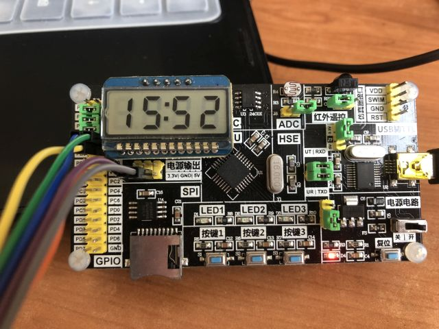
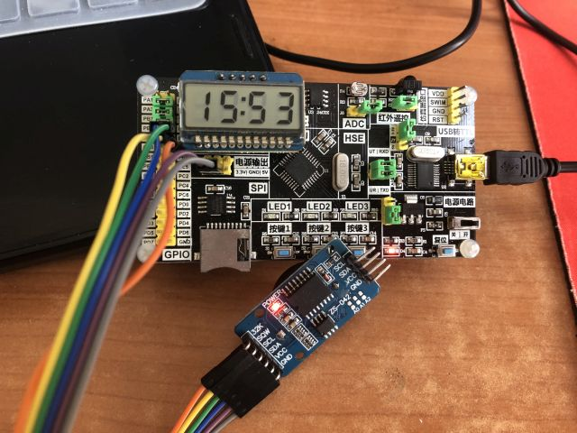

#### 使用STM8S105K4实验板、DS3231模块、HT1621模块的实时时钟实验

程序较为完整地实现了时间显示、时间设置功能，并充分考虑了节电性能，使之比较适合使用电池供电来长时间运行，具备一定的实用性，但程序仍然是实验性的。因为使用了DS3231的SQW脚来输出1Hz信号唤醒MCU，所以程序没有设计闹钟功能。

注:
* 除STM8官方库文件外，部分基础代码源于实验板例程；按键代码源于网络；软件IIC驱动基于原子例程修改；DS3231代码、电源管理代码、全部主程序逻辑为原创。
* 代码中有些源代码文件项目中并未使用，为方便以后使用所以未删除。

---

**运行效果1**

**运行效果2**

